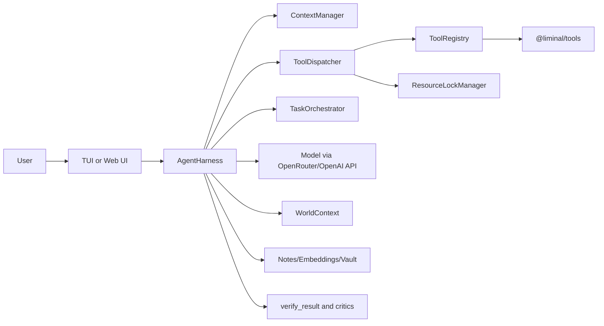

# Liminal

A local-first, tool-using agent harness for real software work.

Liminal is a TypeScript monorepo that combines:

- a reusable core harness (`@liminal/core`)
- a tool runtime (`@liminal/tools`)
- two interfaces (TUI and web)
- an eval framework (`@liminal/eval`)

The focus is not just "chat with a model", but reliable execution: guarded tools, resource locks, memory, context compression, child-agent orchestration, and scenario-based evaluation.

## What Liminal Is

Liminal is an agent runtime for development workflows where the model must:

- reason step-by-step
- call tools with structured schemas
- handle approvals and safety constraints
- preserve useful memory across turns
- run in both interactive UIs and CI-style eval loops

If you have used coding agents that are mostly "prompt wrapper + tool call", Liminal is more opinionated around execution safety and runtime correctness.

## Monorepo Layout

```text
packages/
  core/    Harness engine, context manager, dispatcher, safety, ranking, world context
  tools/   Tool implementations and registration
  tui/     Ink/React terminal UI
  web/     Express + React/SSE web UI
  eval/    Scenario runner and benchmark packs
```

## Architecture at a Glance



## Key Capabilities

- **Structured tool runtime**
  - JSON schema validation, deep arg checking, semantic guardrails.
- **Safety model**
  - `dangerLevel` classification, destructive preflight (`think()`), optional safety judge.
- **Resource locking**
  - Cross-agent lock manager to avoid conflicting writes/shell races.
- **Context management**
  - Token-aware snapshots, compression, working-state injection.
- **Memory and retrieval**
  - Typed notes, lexical + embedding + graph retrieval paths.
- **World grounding**
  - Session injection of OS/shell/date/git/project/tooling context.
- **Orchestration**
  - Child agent spawn/wait/cancel/list and verification utilities.
- **Eval harness**
  - Scenario packs for reliability/noise/memory/approval/long-horizon behavior.

## Installation

### Prerequisites

- Node.js 22+
- npm 10+
- OpenRouter-compatible API key (or compatible OpenAI-style endpoint)

### Install dependencies

```bash
npm install
```

### Environment

Create `.env` at repo root:

```bash
OPENROUTER_API_KEY=...
PORT=3001
```

Important optional variables:

- `AGENT_WORKSPACE_ROOT`: workspace root for world context, notes, artifacts, and tool-relative paths.
- `AGENT_SEND_TIMEOUT_MS`: max wall-clock time per message turn.
- `AGENT_SAFETY_JUDGE=1`: enable heuristic + tiny LLM safety classifier.
- `AGENT_VAULT_PATH`: Obsidian vault root for `vault_*` tools.
- `AGENT_EVAL_JSON_SINK=1`: persist eval run logs.

See `.env.example` for a fuller list.

## Build and Run

### Build all packages

```bash
npm run build
```

### Run terminal UI

```bash
npm run tui
```

### Run web server

```bash
npm run web
```

By default web serves API/SSE and can serve the built client from `packages/web/client/dist`.

### Typecheck all packages

```bash
npm run typecheck
```

### Run core tests

```bash
npm run test
```

## Package Responsibilities

### `@liminal/core`

Core runtime contracts and execution path.

Main modules:

- `agent.ts`: main ReAct loop, retries, turn lifecycle, child harness creation.
- `dispatcher.ts`: tool call parsing, validation, approval/safety path, lock-aware execution.
- `context.ts`: context storage, token estimation, compression logic.
- `orchestrator.ts`: lock manager + task registry.
- `world_context.ts`: environment/project/git/memory/vault/repo map grounding.
- `safety_judge.ts`: heuristic + model-assisted safety classification.

### `@liminal/tools`

Tool implementations and registration.

- `index.ts`: single registration entrypoint (`registerAllTools`).
- Includes file/shell/process tools, memory tools, orchestration tools, critics, browser helpers, and code tooling helpers.
- Harness-scoped tools are created per harness instance (important for parent/child correctness).

### `@liminal/tui`

Ink UI with event-driven rendering of:

- assistant text
- tool execution cards
- approval prompts
- subtask status
- end-of-turn summaries

### `@liminal/web`

- Express server + SSE event bridge from harness to browser.
- React client consuming stream state similarly to TUI reducer model.

### `@liminal/eval`

- Scenario runner over real harness behavior.
- Supports packs for reliability, memory retrieval, approval correctness, research-grade, and long-horizon tasks.

## Workspace Root Semantics

Liminal uses a unified workspace root model:

- `resolveWorkspaceRoot()` in core resolves from:
  1. `AGENT_WORKSPACE_ROOT` (if set)
  2. `process.cwd()` fallback

Entrypoint bootstraps (TUI/web/eval) normalize this early so:

- world context reports the intended workspace root
- `.agent_notes.json`, `.agent_memory.index.json`, `.agent_artifacts`, and eval logs resolve consistently
- tool relative paths default to the same root

If you want isolated sandbox execution, set:

```bash
AGENT_WORKSPACE_ROOT=/absolute/path/to/sandbox
```

## Safety and Approval Model

Liminal safety is layered:

1. **Schema validation**: reject malformed tool args.
2. **Argument guardrails**: deny dangerous/invalid argument patterns.
3. **Danger preflight**: destructive tools require `think()` preflight.
4. **Approval policy**: currently prompts primarily for destructive operations.
5. **Optional safety judge**: heuristic + minimal model check to classify safe vs require-human.

Resource locks protect against conflicting concurrent operations across child agents.

## Memory Model

Persistent note store supports typed entries:

- `fact`
- `experience`
- `entity`
- `belief`
- `reflection`
- `recipe`

Retrieval modes include:

- exact
- lexical (BM25-style)
- hybrid lexical + embedding
- graph-informed retrieval

Purpose: preserve durable context while keeping turn-time prompts concise.

## Evaluation Strategy

`@liminal/eval` runs scenario assertions over live harness behavior.

Typical use:

```bash
npm run eval --workspace=@liminal/eval
```

Filtering/scoping:

- `--only <substring-or-pack>`
- `--parallel <n>`
- `--repeat <k>`
- `--any-pass`

Use evals to validate behavior shifts in:

- safety policy
- retrieval quality
- approval logic
- long-horizon tool sequencing

## Development Workflow

Recommended loop:

1. Edit code.
2. Build `core` then `tools` when changing shared internals:
   ```bash
   npm run build -w packages/core
   npm run build -w packages/tools
   ```
3. Run full typecheck:
   ```bash
   npm run typecheck
   ```
4. Run core tests:
   ```bash
   npm run test
   ```
5. Smoke test TUI or web for behavioral changes.

## Known Sharp Edges

- Build order matters (`core` before `tools` before dependent apps).
- Harness-scoped tools must be wired correctly for child agents, or child behavior diverges from root harness behavior.
- Approval/safety semantics are policy-sensitive; changing one gate can shift agent autonomy significantly.
- World context is intentionally rich and broad; edits there should be carefully verified for performance and regressions.

## Why This Project Stands Out

Compared to many "chat agent" repos, Liminal emphasizes:

- runtime correctness under tool orchestration
- explicit safety and locking semantics
- durable memory with multiple retrieval strategies
- integrated eval and critic loops
- both interactive UI and benchmark harness paths

The value proposition is reliability and controllability, not only prompt quality.

## Contributing

When submitting changes:

- keep `core`/`tools` boundaries clean (no circular dependency leaks)
- preserve harness-scoped tool invariants
- add or update eval scenarios for behavior changes
- include verification notes (typecheck/tests/manual smoke)

Architecture and invariants are documented in `CLAUDE.md`.

