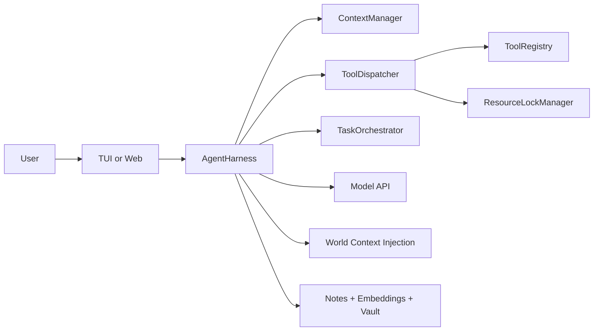

# Liminal

Liminal is a local-first agent runtime for real software execution. It is built for long, tool-heavy tasks where reliability matters more than demo fluency.

The system combines:

- strict tool execution contracts
- lock-safe concurrency and child-agent orchestration
- context compression + working-state management
- durable memory and Obsidian-compatible vault integration
- real-time TUI/web interfaces
- eval packs that detect behavioral regressions

## Why It Exists

Most agent stacks are "model + tools + prompt". Liminal is focused on runtime guarantees:

- validated arguments and guarded tool calls
- bounded retries and anti-loop controls
- deterministic resource locking across concurrent tasks
- explicit long-horizon state (`mission`, `contracts`, `drift`, `recovery`)
- evidence-aware finalization and critic checks

## Fast Start

### Prerequisites

- Node.js 22+
- npm 10+
- OpenRouter/OpenAI-compatible API key

### Install

```bash
npm install
```

### Minimal `.env`

```bash
OPENROUTER_API_KEY=...
PORT=3001
```

### Run

```bash
npm run build
npm run tui
# or
npm run web
```

### Verify

```bash
npm run typecheck
npm run test
```

## Core Runtime Guarantees (Most Important)

1. **World-grounded operation**
  Root sessions inject world context (current date/time/timezone, OS, shell, cwd, git, project signals, memory summary, repo map). This prevents time/shell hallucination drift.
2. **Strict tool dispatch pipeline**
  Every tool call goes through schema validation, argument guardrails, optional safety policy, lock acquisition, approval flow, then execution.
3. **Long-horizon coherence state**
  Runtime tracks mission/contracts/milestones, heartbeat and drift score, contract transitions, and recovery actions when rounds fail.
4. **Research quality controls**
  Query diversity checks, duplicate-intent throttling, temporal anchoring for latest/news searches, and synthesis checklist nudges.
5. **Memory + vault knowledge growth**
  Retrieval prefers memory/vault before web (advisory by default), and research-style runs can auto-persist durable notes.
6. **UI streaming hardening**
  Stream chunk normalization and buffered flush ordering reduce garbled glyphs and repaint artifacts in TUI/web.

## Architecture Snapshot




Package layout:

```text
packages/
  core/   Harness engine, dispatcher, context, orchestration
  tools/  Tool implementations, protocol, tool catalog
  tui/    Ink terminal interface
  web/    Express + SSE + React client
  eval/   Scenario runner and assertion packs
```

Build order matters: `core` -> `tools` -> (`tui` / `web` / `eval`)

## Commands

Root:

```bash
npm run build
npm run tui
npm run web
npm run typecheck
npm run test
```

Workspace-specific:

```bash
npm run build -w packages/core
npm run build -w packages/tools
npx tsc --noEmit -p packages/core/tsconfig.json
npx tsc --noEmit -p packages/tools/tsconfig.json
npx tsc --noEmit -p packages/tui/tsconfig.json
npx tsc --noEmit -p packages/web/tsconfig.json
npm run eval -w packages/eval
```

## Essential Configuration Profiles

Use `.env.example` for full options.

- **Minimal stable**
  - `OPENROUTER_API_KEY`
  - `PORT=3001`
- **Safety-first**
  - `AGENT_SAFETY_JUDGE=1`
  - `AGENT_DESTRUCTIVE_GATE=balanced`
  - `AGENT_APPROVAL_TIMEOUT_MS=120000`
- **Memory-rich**
  - `AGENT_EMBED_MODEL=openai/text-embedding-3-small`
  - `AGENT_MEMORY_AUTO_EXTRACT=1`
  - `AGENT_RECALL_EVERY_N=3`
  - `AGENT_MEMORY_GRAPH=1`
- **Vault wiki mode**
  - `AGENT_VAULT_PATH=C:\path\to\vault`
  - `AGENT_VAULT_AUTO_WRITE=research` (default behavior when unset)
  - `AGENT_VAULT_FIRST_STRICT=1` (optional strict blocking mode)

## Documentation Index

Deep technical docs live under `docs/`:

- `[docs/architecture.md](docs/architecture.md)` — engine architecture, lifecycle, invariants
- `[docs/runtime-behavior.md](docs/runtime-behavior.md)` — world context, execution state, drift/recovery, finalization
- `[docs/research-quality.md](docs/research-quality.md)` — query diversity, anti-looping, time anchoring, synthesis quality
- `[docs/memory-and-vault.md](docs/memory-and-vault.md)` — memory model, vault policy, auto-write semantics
- `[docs/ui-streaming.md](docs/ui-streaming.md)` — TUI/web streaming model and artifact mitigation
- `[docs/configuration.md](docs/configuration.md)` — grouped `AGENT_`* flags with defaults and interactions
- `[docs/telemetry-and-events.md](docs/telemetry-and-events.md)` — event catalog and observability semantics
- `[docs/evaluation.md](docs/evaluation.md)` — eval scenarios, guarantees, and extension patterns
- `[docs/troubleshooting.md](docs/troubleshooting.md)` — common failures and runbooks

## Contributing

- Preserve `core`/`tools` boundaries (avoid circular coupling).
- Be careful with harness-scoped tools in child-agent creation paths.
- Validate with typecheck/tests and a UI smoke run for behavioral changes.
- Include rationale for safety, memory, orchestration, or protocol shifts.

For additional implementation constraints, see `CLAUDE.md`.