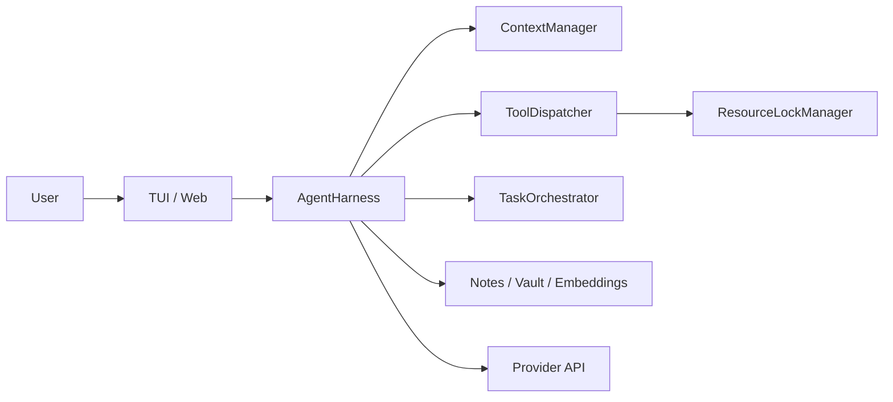

# Liminal

Liminal is a local-first, production-oriented agent runtime for tool-heavy software work.  
It is designed for reliability over demo polish: strict tool execution, resilient orchestration, and long-horizon task continuity.

## Why Liminal

Most agent stacks stop at model plus tools plus prompt. Liminal adds runtime discipline:

- deterministic tool dispatch with schema and safety gates
- lock-safe concurrency for parallel and child-agent execution
- context pressure management with compression and working-state tracking
- durable memory with optional Obsidian-compatible vault workflows
- observable execution via streaming UI events and telemetry
- regression-focused eval suites for behavior drift detection

## Core Capabilities

- **Runtime Engine**: ReAct harness with retries, recovery paths, and execution contracts
- **Tooling Layer**: Typed tool registry with guardrails and resource locking
- **State & Memory**: Epistemic state, execution state, durable notes, and recall ranking
- **Interfaces**: Real-time TUI and web client with SSE-backed event streaming
- **Evaluation**: Scenario packs for reliability, retrieval quality, and long-horizon behavior

## Architecture



## Repository Layout

```text
packages/
  core/   Runtime engine, orchestration, context, safety, memory ranking
  tools/  Tool implementations, protocol, and tool families
  tui/    Ink terminal interface
  web/    Express + SSE server and React client
  eval/   Scenario-based evaluation suite
```

Build order matters: `core` -> `tools` -> (`tui` / `web` / `eval`)

## Quick Start

### Prerequisites

- Node.js 22+
- npm 10+
- OpenAI-compatible model endpoint (OpenRouter/OpenAI/other compatible gateway)

### 1) Install

```bash
npm install
```

### 2) Configure environment

Create `.env` in repo root:

```bash
AGENT_API_KEY=your_key_here
AGENT_API_BASE_URL=https://openrouter.ai/api/v1
AGENT_MODEL=openrouter/owl-alpha
PORT=3001
```

### 3) Build

```bash
npm run build
```

### 4) Run

```bash
# terminal UI
npm run tui

# web UI
npm run web
```

## Developer Commands

```bash
# full build + checks
npm run build
npm run typecheck
npm run test

# workspace-specific
npm run build -w packages/core
npm run build -w packages/tools
npm run eval -w packages/eval
```

## Configuration Profiles

Use `.env.example` for the full set of options.

- **Minimal**
  - `AGENT_API_KEY`
  - `AGENT_API_BASE_URL`
  - `AGENT_MODEL`
- **Safety-first**
  - `AGENT_SAFETY_JUDGE=1`
  - `AGENT_DESTRUCTIVE_GATE=balanced`
- **Memory-heavy**
  - `AGENT_EMBED_MODEL=<embedding-model>`
  - `AGENT_MEMORY_AUTO_EXTRACT=1`
  - `AGENT_RECALL_EVERY_N=3`
- **Vault mode**
  - `AGENT_VAULT_PATH=<absolute-path>`
  - `AGENT_VAULT_AUTO_WRITE=research`

## Documentation

See `docs/` for implementation details:

- `docs/architecture.md`
- `docs/runtime-behavior.md`
- `docs/memory-and-vault.md`
- `docs/research-quality.md`
- `docs/telemetry-and-events.md`
- `docs/evaluation.md`
- `docs/troubleshooting.md`

## Contributing

- preserve `core`/`tools` boundaries and avoid circular dependencies
- keep harness-scoped tool behavior explicit and testable
- run typecheck/tests before opening a PR
- document rationale for safety, orchestration, or memory behavior changes

For repository-specific implementation rules, see `CLAUDE.md`.