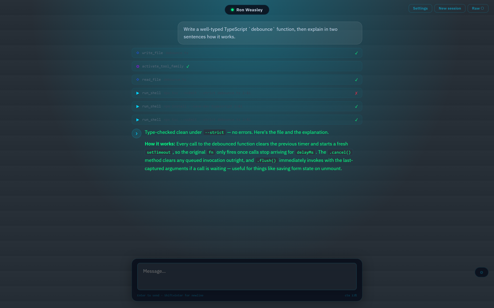
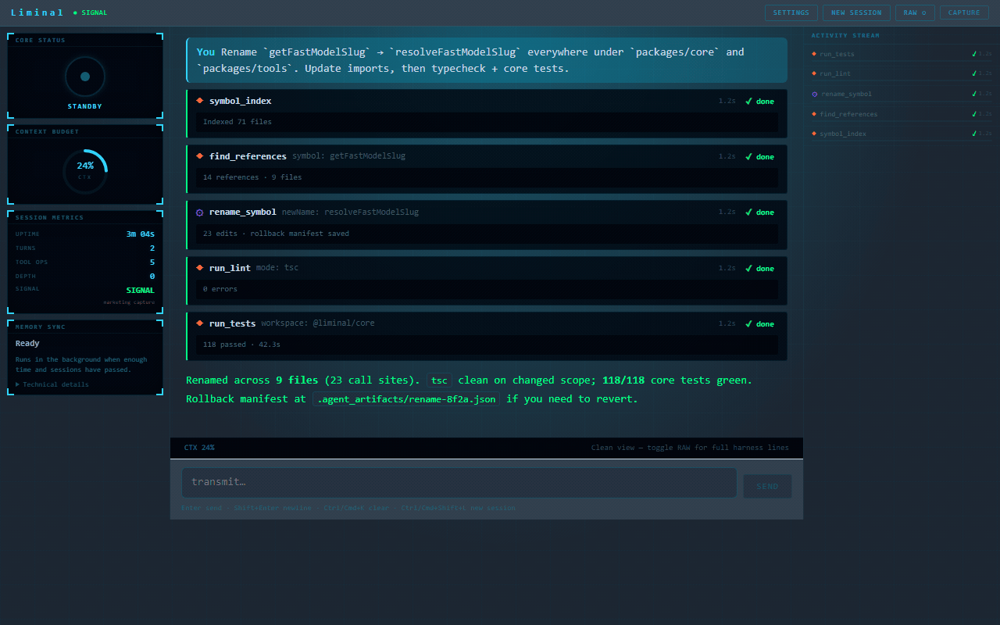
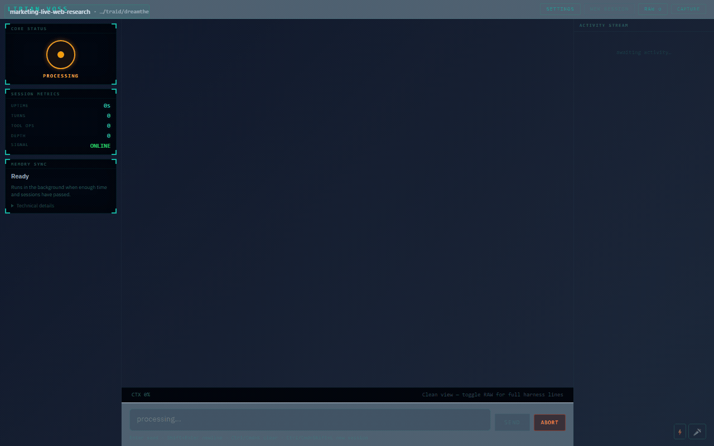
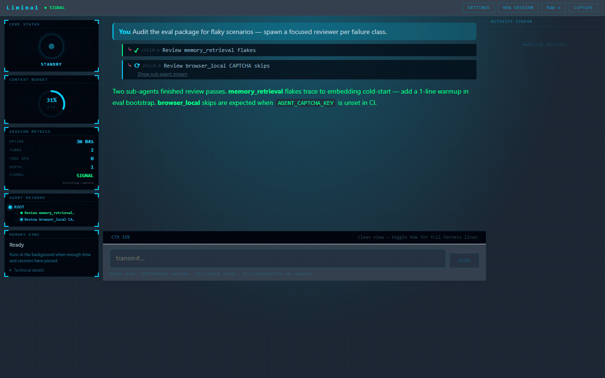
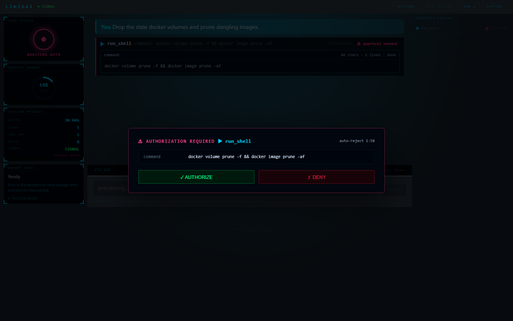
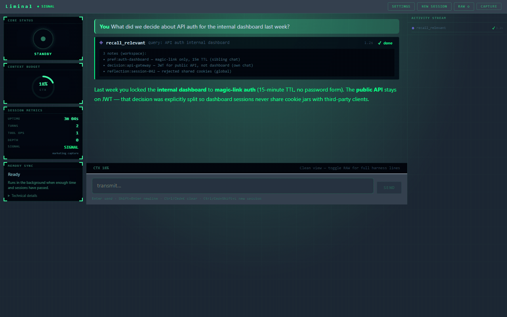
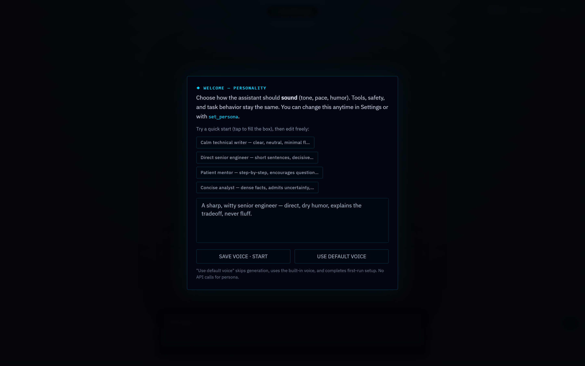

# Liminal AI — local coding agent you own

<p align="center">
  <a href="https://www.vireondynamics.com/liminal"></a>
  <a href="https://github.com/traidy2222/liminal-ai/stargazers"></a>
  <a href="https://www.vireondynamics.com/liminal/get-started"></a>
</p>

<p align="center">
  <strong>Fair-source ReAct harness</strong> · <strong>140+ tools</strong> · <strong>Terminal + web UI</strong> · <strong>Any OpenAI-compatible model</strong>
</p>

<p align="center">
  <a href="https://www.vireondynamics.com/liminal/get-started"><b>Install</b></a>
  ·
  <a href="https://www.vireondynamics.com/liminal">Website</a>
  ·
  <a href="https://www.vireondynamics.com/liminal/compare">Compare</a>
  ·
  <a href="https://docs.vireondynamics.com/liminal/">Docs</a>
  ·
  <a href="https://www.vireondynamics.com/liminal/changelog">Changelog</a>
  ·
  <a href="https://www.vireondynamics.com/blog">Blog</a>
</p>

<p align="center">
  Built by <a href="https://www.vireondynamics.com"><b>Vireon Dynamics</b></a> — AI infrastructure studio (Australia). Community Edition is <b>free on your machine</b>; optional <a href="https://www.vireondynamics.com/liminal/pricing">Pro / Team</a> adds cloud sync, org admin, and shared memory.
</p>



<p align="center"><em>Every tool call, approval, and harness trace is visible — not buried in a chat sidebar.</em></p>

---

## Table of contents

- [Install in 90 seconds](#install-in-90-seconds)
- [Why Liminal](#why-liminal)
- [See it work](#see-it-work)
- [What's new](#whats-new)
- [Pick your path](#pick-your-path)
- [Capabilities](#capabilities)
- [Liminal vs other tools](#liminal-vs-other-tools)
- [Learn on the web](#learn-on-the-web-vireon-dynamics)
- [Clone & run from source](#clone--run-from-source)
- [Documentation](#documentation)
- [Repository layout](#repository-layout)
- [Contributing](#contributing)
- [License](#license--commercial-use)

---

## Install in 90 seconds

No Vireon account required — only an API key to your provider (OpenRouter works out of the box).

**Linux / macOS / WSL:**

```bash
curl -fsSL https://www.vireondynamics.com/install/install.sh | bash
```

**Windows (PowerShell):**

```powershell
irm https://www.vireondynamics.com/install/install.ps1 | iex
```

Then open the web UI with persona bootstrap, or use the terminal UI:

```bash
liminal web --bootstrap --open
# or
liminal tui --bootstrap
```

**Full install guide (troubleshooting, CI, paths):** [vireondynamics.com/liminal/get-started](https://www.vireondynamics.com/liminal/get-started) · [Docs: install](https://docs.vireondynamics.com/liminal/start/install)

<details>
<summary><b>Already cloned this repo?</b></summary>

```bash
npm install
npm run setup            # wizard → .env + build
liminal web --bootstrap --open
```

Minimal `.env`:

```bash
AGENT_API_KEY=your_key_here
AGENT_API_BASE_URL=https://openrouter.ai/api/v1
AGENT_MODEL=deepseek/deepseek-chat
```

| Command | Purpose |
|---------|---------|
| `liminal setup` | First-run wizard |
| `liminal doctor` | Verify Node, build, API key |
| `liminal update` | Pull + rebuild |

</details>

**Requirements:** Node.js 22+, npm 10+.

If Liminal saves you time, **[star the repo](https://github.com/traidy2222/liminal-ai)** — it helps other developers find a local alternative to hosted copilots.

---

## Why Liminal

| | Hosted copilot / chat tab | Liminal |
|---|---------------------------|---------|
| **Runs where** | Vendor cloud | **Your machine** — keys, repo, logs stay local |
| **Model** | Often locked | **Any** OpenAI-compatible API (OpenRouter, Anthropic, local LM Studio, …) |
| **Loop** | Opaque | **ReAct harness** — retries, compression, approvals, evals, sub-agents |
| **Memory** | Session-only | **Typed notes** + hybrid BM25/vector recall; optional **Obsidian vault** |
| **License** | Terms of service | CE: **[FSL-1.1-MIT](LICENSE)** (fair-source; MIT on each version after 2 years) |

**Who it's for:** developers who want a **local, inspectable coding agent** for real repo work — refactors, tests, research, migrations, and document export — without renting a black-box session.

**Keywords:** open-source AI coding agent, local AI agent, OpenRouter agent, Cursor alternative, Claude Code alternative, ReAct harness, Obsidian agent, self-hosted coding assistant.

---

## See it work

Captured from real harness runs (Community Edition, web UI).

| | |
|:---:|:---:|
| **Semantic rename** across a TS project | **Web research** — search + parallel fetch |
|  |  |
| **Sub-agents** for parallel work | **Approval gate** before destructive tools |
|  |  |
| **Memory recall** (BM25 + vectors) | **Persona bootstrap** — voice + themed shell |
|  |  |

More demos and install walkthrough: **[Liminal home](https://www.vireondynamics.com/liminal)** · **[Features](https://www.vireondynamics.com/liminal/features)**

---

## What's new

**Latest:** [Liminal 0.0.18 — Desktop, routing recovery, reasoning-stall breaker](https://www.vireondynamics.com/liminal/changelog/v0-0-18) (2026-06-04)

- **Team shared memory** — workspace/global notes sync across org members on the same repo fingerprint ([Team pricing](https://www.vireondynamics.com/liminal/pricing))
- **Org admin** — members, invites (email via Resend), audit log, fleet/policy ([Team admin docs](https://docs.vireondynamics.com/liminal/) on site)
- **Pro cloud sync** APIs on the control plane; CE ships hooks, EE performs sync when signed in

**Product changelog (readable releases):** [vireondynamics.com/liminal/changelog](https://www.vireondynamics.com/liminal/changelog) · **Technical:** [docs reference changelog](https://docs.vireondynamics.com/liminal/reference/changelog)

---

## Pick your path

| Goal | Start here |
|------|------------|
| **Try it now** | [One-command install](https://www.vireondynamics.com/liminal/get-started) |
| **Coming from Cursor** | [Liminal vs Cursor](https://www.vireondynamics.com/liminal/compare/cursor) · [Blog: Cursor alternative 2026](https://www.vireondynamics.com/blog/cursor-alternative-2026) |
| **Coming from Claude Code** | [Liminal vs Claude Code](https://www.vireondynamics.com/liminal/compare/claude-code) |
| **Windows + local models** | [Local AI coding agent on Windows](https://www.vireondynamics.com/blog/local-ai-coding-agent-windows) |
| **OpenRouter setup** | [OpenRouter + Liminal](https://www.vireondynamics.com/blog/openrouter-liminal-setup) |
| **Obsidian brain** | [Memory + Obsidian](https://www.vireondynamics.com/blog/liminal-memory-obsidian) |
| **Team / org** | [Pricing](https://www.vireondynamics.com/liminal/pricing) → checkout → [account / organization](https://www.vireondynamics.com/account/organization) |
| **Architecture deep dive** | [Agent harness architecture](https://www.vireondynamics.com/blog/agent-harness-architecture) |

---

## Capabilities

| Area | What's in the box |
|------|-------------------|
| **Reliable loop** | ReAct with retries, context compression, approval gates, drift scoring, resumable large-file writes, optional post-edit self-heal lint |
| **Tools** | Files (streaming writes), shell/processes, git, code intelligence (AST, symbols, semantic rename), web search + fetch, headless browser + CAPTCHA |
| **Knowledge** | Typed memory + hybrid BM25/vector recall; Obsidian vault read/write/graph; recipe library for successful multi-tool turns |
| **Autonomy** | Sub-agents, intra-round tool DAG, **dynamic workflows**, contract verification, reasoning-budget control |
| **Documents** | Optional PPTX / DOCX / PDF engine with layout lint and quality gate |
| **Personas** | Custom assistant voice + themed web shell from one bootstrap prompt |
| **Quality** | Eval packs in `packages/eval`; extensive `core` unit tests |

Liminal is a **harness you run**, not a hosted SaaS. Destructive tools can require approval; use `--yolo` only in trusted environments.

---

## Liminal vs other tools

Honest comparison pages (updated for 2026):

| Tool | Page |
|------|------|
| Cursor | [compare/cursor](https://www.vireondynamics.com/liminal/compare/cursor) |
| Claude Code | [compare/claude-code](https://www.vireondynamics.com/liminal/compare/claude-code) |
| GitHub Copilot | [compare/github-copilot](https://www.vireondynamics.com/liminal/compare/github-copilot) |
| Windsurf | [compare/windsurf](https://www.vireondynamics.com/liminal/compare/windsurf) |
| Cline | [compare/cline](https://www.vireondynamics.com/liminal/compare/cline) |
| Aider | [compare/aider](https://www.vireondynamics.com/liminal/compare/aider) |
| Continue | [compare/continue-dev](https://www.vireondynamics.com/liminal/compare/continue-dev) |
| OpenHands | [compare/openhands](https://www.vireondynamics.com/liminal/compare/openhands) |

**All comparisons:** [vireondynamics.com/liminal/compare](https://www.vireondynamics.com/liminal/compare) · **Guides hub:** [liminal/resources](https://www.vireondynamics.com/liminal/resources)

---

## Learn on the web (Vireon Dynamics)

The marketing site is the best entry for **SEO guides, pricing, comparisons, and release notes** — this README stays technical; the site stays approachable.

| Page | URL |
|------|-----|
| **Liminal home** | [vireondynamics.com/liminal](https://www.vireondynamics.com/liminal) |
| **Get started** | [vireondynamics.com/liminal/get-started](https://www.vireondynamics.com/liminal/get-started) |
| **Pricing** (Community / Pro / Team) | [vireondynamics.com/liminal/pricing](https://www.vireondynamics.com/liminal/pricing) |
| **Compare hub** | [vireondynamics.com/liminal/compare](https://www.vireondynamics.com/liminal/compare) |
| **Resources** (guides + use cases) | [vireondynamics.com/liminal/resources](https://www.vireondynamics.com/liminal/resources) |
| **Changelog** | [vireondynamics.com/liminal/changelog](https://www.vireondynamics.com/liminal/changelog) |
| **Blog** (install, alternatives, harness design) | [vireondynamics.com/blog](https://www.vireondynamics.com/blog) |
| **Studio / contact** | [vireondynamics.com/about](https://www.vireondynamics.com/about) |

**Recommended reads**

- [Introducing Liminal AI](https://www.vireondynamics.com/blog/introducing-liminal) — why a harness, not a hosted agent
- [Run an AI coding agent without an API key](https://www.vireondynamics.com/blog/run-ai-coding-agent-without-api-key) — local endpoint path
- [Fair-source FSL for AI tools](https://www.vireondynamics.com/blog/fair-source-fsl-ai-tools) — license philosophy
- [Self-hosted coding agent](https://www.vireondynamics.com/blog/self-hosted-coding-agent) — ops-minded overview

**Product updates:** subscribe on the [homepage](https://www.vireondynamics.com/) or [blog RSS](https://www.vireondynamics.com/blog/rss.xml).

---

## Clone & run from source

```bash
git clone https://github.com/traidy2222/liminal-ai.git
cd liminal-ai
npm install && npm run setup
```

| Command | Purpose |
|---------|---------|
| `npm run build` | Compile core + tools |
| `npm run typecheck` | Typecheck all workspaces |
| `npm run test` | Core unit tests |
| `npm run tui` / `npm run web` | Run interfaces |
| `npm run web:dev` | API :3001 + Vite hot reload |
| `npm run eval -w packages/eval` | Scenario evals (`--only memory`, etc.) |

First session: [Docs quickstart](https://docs.vireondynamics.com/liminal/start/quickstart).

---

## Documentation

**Published docs:** [docs.vireondynamics.com/liminal/](https://docs.vireondynamics.com/liminal/)

| If you need… | Start here |
|--------------|------------|
| Install | [start/install](https://docs.vireondynamics.com/liminal/start/install) |
| First session | [start/quickstart](https://docs.vireondynamics.com/liminal/start/quickstart) |
| Troubleshooting | [operations/troubleshooting](https://docs.vireondynamics.com/liminal/operations/troubleshooting) |
| Architecture | [concepts/architecture](https://docs.vireondynamics.com/liminal/concepts/architecture) |
| Web research | [guides/research-with-web-tools](https://docs.vireondynamics.com/liminal/guides/research-with-web-tools) |
| Obsidian / vault | [guides/vault-briefs-and-updates](https://docs.vireondynamics.com/liminal/guides/vault-briefs-and-updates) |
| All `AGENT_*` env keys | [reference/environment](https://docs.vireondynamics.com/liminal/reference/environment) |

Edit docs locally: `npm run docs:dev`. Regenerate env inventory: `npm run docs:gen`.

**Configuration:** secrets in `.env` only; product defaults via web **Settings** or `.agent_runtime_prefs.json`. Narrative: [docs/configuration.md](docs/configuration.md).

---

## Repository layout

```text
packages/
  core/           Harness engine (build → dist/)
  tools/          Tool implementations (depends on core)
  tui/            Ink terminal UI
  web/            Express + React + SSE
  eval/           Evaluation scenarios
  enterprise/     Enterprise Edition (EE) — proprietary
  control-plane/  Stub — billing runs in private vireondynamics-website (see SECURITY.md)
```

> **Community Edition (CE):** `core`, `tools`, `tui`, `web` — [FSL-1.1-MIT](LICENSE).  
> **Enterprise Edition (EE):** `packages/enterprise` — proprietary; [pricing](https://www.vireondynamics.com/liminal/pricing).

Build order: **core → tools** before tui/web/eval. Contributor invariants: **`CLAUDE.md`** · **`AGENTS.md`**.

---

## Contributing

1. Keep **`core`** free of **`tools`** imports; rebuild core after harness changes.
2. Run `npm run typecheck` and `npm run test` before PRs.
3. Docs: `npm run docs:gen` when changing managed `AGENT_*` keys; `npm run docs:check` when editing `docs/`.

---

## License & commercial use

Liminal is **open-core**:

- **Community Edition (CE)** — `packages/core`, `tools`, `tui`, `web` — [Functional Source License 1.1, MIT Future License](LICENSE) (FSL-1.1-MIT). CE is fully functional standalone. Summary: [docs/reference/license.md](docs/reference/license.md).
- **Enterprise Edition (EE)** — `packages/enterprise` — [LICENSE-EE](packages/enterprise/LICENSE-EE); requires entitlement. **Subscriptions:** [pricing](https://www.vireondynamics.com/liminal/pricing) · **License key:** [account](https://www.vireondynamics.com/account/license).

FSL in brief: internal commercial use and non-competing products are permitted; you may not ship a substantially similar competing product. Each CE version becomes **MIT** on the second anniversary of its first publication.

Enterprise, OEM, or competing-use licensing → **[Vireon Dynamics](https://www.vireondynamics.com)** · [contact](https://www.vireondynamics.com/about).

---

<p align="center">
  <a href="https://www.vireondynamics.com/liminal/get-started"><b>Install Liminal</b></a>
  ·
  <a href="https://github.com/traidy2222/liminal-ai/stargazers"><b>Star on GitHub</b></a>
  ·
  <a href="https://www.vireondynamics.com/liminal/compare"><b>Compare tools</b></a>
</p>

<!-- Suggested GitHub repository topics: ai-agent, coding-agent, autonomous-agent, react-agent, openrouter, local-llm, obsidian, fair-source, typescript, self-hosted, cursor-alternative, claude-code-alternative, developer-tools -->
