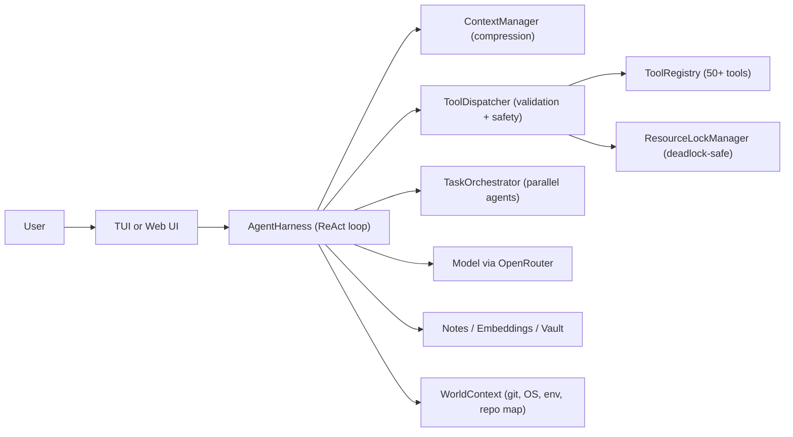

# Liminal

> An autonomous agent harness that reasons, acts, remembers, and coordinates — built for real work, not demos.

Liminal is a TypeScript monorepo powering a production-grade AI agent runtime. Give it a goal and it will plan, execute tools, spawn parallel sub-agents, compress its own context when it grows large, remember what it learns, verify its own output, and ask you before doing anything dangerous. It runs inside a slick terminal UI or a streaming web interface — and a scenario-based eval harness lets you measure every behavior change you ship.

---

## What You Can Actually Do With This

These aren't toy examples. Each scenario is driven by the same harness, the same tool set, the same memory system.

### Parallelize a big refactor across an entire codebase

```
Refactor all API endpoints to use the new auth middleware.
Run tests after each file changes. Commit only if tests pass.
```

Liminal spawns one sub-agent per module, each with its own isolated tool scope. They work in parallel, writing different files — the resource lock manager ensures no two agents touch the same path at the same time. When all finish, the parent verifies the combined output and opens a commit.

---

### Build a living research knowledge base

```
Research the latest papers on speculative decoding.
Summarize each one, extract key claims, link related concepts,
and store everything in my vault with backlinks.
```

The agent runs a multi-source web research pipeline, extracts article text with readability, writes structured Obsidian notes with `[[Wikilinks]]`, then traverses the resulting knowledge graph to surface connections you didn't ask for. The vault persists across sessions. Next time you ask about inference optimization, it already knows.

---

### Debug a broken CI run end-to-end

```
The GitHub Actions workflow is failing. Figure out why and fix it.
```

Liminal checks `git status`, reads the workflow YAML, runs the failing command locally via `run_shell`, reads the error output, patches the config, re-runs the tests, and commits the fix — all without leaving the terminal. If the fix involves a risky shell command it hasn't seen before, it pauses and asks you.

---

### Automate a multi-step data pipeline

```
Fetch the last 30 days of sales data from the API,
normalize it, merge with the customer CSV, and produce a report.
```

The agent fetches the API (handling pagination), writes intermediate files, runs transformation scripts, reads their output, and synthesizes a final artifact. If a step fails it classifies the error, thinks through recovery, retries with a corrected approach, and logs what went wrong for later review.

---

### Run autonomous overnight research

```
Evaluate five open-source embedding models on our retrieval benchmark.
For each: clone the repo, install deps, run the eval script, record results.
Summarize findings in the morning.
```

Five sub-agents work in parallel, each in an isolated workspace. The orchestrator tracks completion, collects structured results, and the parent synthesizes a comparison report. You wake up to a finished summary and a memory note with the winner — ready for the next conversation.

---

## Architecture

```
packages/
  core/    ReAct loop, context manager, dispatcher, safety, resource locks
  tools/   50+ tool implementations
  tui/     Ink/React terminal UI
  web/     Express + React/SSE web UI
  eval/    Scenario runner and benchmark packs
```



---

## Tool Set

Liminal ships 50+ tools across ten families. When `AGENT_TOOL_LAZY=1` only a minimal set is exposed per round; the agent activates families on demand.

| Family | Tools |
|---|---|
| **Files** | `read_file`, `write_file`, `patch_file`, `apply_diff`, `list_dir`, `repo_map` |
| **Shell** | `run_shell`, `run_background`, `kill_process`, `list_processes`, `read_process_output` |
| **Git** | `git_status`, `git_diff`, `git_log`, `git_branch`, `git_commit` |
| **Code Intel** | `ast_grep`, `symbol_index`, `find_references`, `run_tests`, `run_lint` |
| **Web** | `web_fetch`, `web_search`, `web_research` |
| **Memory** | `remember`, `recall`, `search_memory`, `recall_relevant`, `memory_query`, `memory_graph`, `memory_consolidate` |
| **Vault** | `vault_write`, `vault_read`, `vault_search`, `vault_list`, `vault_links`, `vault_graph`, `vault_delete` |
| **Orchestration** | `spawn_agent`, `wait_for_agents`, `cancel_agent`, `list_agents`, `verify_result` |
| **Context** | `check_context`, `compress_context`, `refresh_world_context` |
| **Reasoning** | `think`, `plan`, `ask_user`, `extract_structured` |
| **Browser** *(opt-in)* | `browser_open`, `browser_act` |

---

## Memory System

Liminal's memory is not a conversation summary — it's a typed, queryable knowledge store that persists across sessions.

**Note types**: `fact` · `experience` · `entity` · `belief` · `reflection` · `recipe`

**Retrieval modes**:
- Exact key lookup
- Type-scoped recall
- BM25 lexical search
- Embedding-backed semantic search with reranking
- Knowledge graph BFS traversal

**Auto-reflexion**: On a round where every tool fails, the harness writes a `reflection:` note capturing what went wrong and why. On a successful turn with 4+ tool calls, it writes a `recipe:` note with the successful pattern. Both are immediately retrievable in future turns and future sessions.

**Obsidian vault**: `vault_*` tools write Obsidian-compatible markdown with `[[Wikilinks]]`, frontmatter, and tags. The vault graph tools let the agent traverse forward links and backlinks from any note.

---

## Safety and Approval Model

Liminal is built for real execution, so safety is layered — not bolted on.

1. **Schema validation** — malformed tool args are rejected before execution
2. **Argument guardrails** — dangerous flag patterns and path escapees are denied at dispatch
3. **Danger preflight** — `run_shell` and `run_background` require a `think()` call in the same round; missing it blocks execution
4. **Approval gate** — destructive and sensitive operations pause for human review; you can edit the proposed command before approving
5. **Safety judge** *(optional)* — a heuristic + single-token LLM classifier pre-screens candidates; clearly safe calls pass without a prompt, clearly dangerous ones are blocked
6. **Resource locking** — all file and shell locks are acquired in alphabetical order, preventing deadlocks across parallel agents; stale locks are TTL-evicted

---

## Multi-Agent Orchestration

The `spawn_agent` tool forks an independent child harness with:

- its own conversation context
- a scoped tool registry (grandchildren cannot spawn; parent tools excluded by design)
- shared resource lock manager so concurrent writes are coordinated
- a task entry in the `TaskOrchestrator` the parent can poll or wait on

The parent calls `wait_for_agents([id1, id2, ...])` to collect results and continue. Child output streams back as `subtask_output` events visible in both TUI and web.

Default limits: 8 concurrent agents, depth 3. Both are configurable in `AgentConfig`.

---

## Context Intelligence

The agent tracks its own context and manages it actively.

**ACON-lite compression**: when usage crosses a configurable threshold, old rounds are collapsed into a structured summary block — not blanked, structured. The agent can trigger this manually with `compress_context()`.

**Working State** *(on by default)*: every turn appends a `[WORKING STATE]` block with the current goal, subgoal status, hypotheses with confidence scores, files touched, open questions, and a token budget hint. This is visible in TUI and web, giving you a live epistemic picture.

**World context**: each session is grounded with the current date, OS, shell, `$CWD`, open ports, git status, and a shallow repo map. The agent can refresh this mid-task with `refresh_world_context()`.

---

## Both Interfaces

### Terminal UI

```bash
npm run tui
```

Ink/React renderer with streaming tool execution cards, approval prompts, subtask depth views, think bubbles, and end-of-turn summaries. Keyboard-driven.

### Web UI

```bash
npm run web
# API + SSE on :3001 — Vite client on :5173
```

React client consuming the same SSE event stream. Same reducer pattern as the TUI. Useful when you want a browser window or want to embed the agent in a larger app.

---

## Eval Harness

`@liminal/eval` runs scenario assertions over live harness behavior — not mocked, the real ReAct loop.

```bash
npm run eval --workspace=@liminal/eval
npm run eval --workspace=@liminal/eval -- --only memory
npm run eval --workspace=@liminal/eval -- --parallel 4 --repeat 3
```

Scenario packs cover:
- **Reliability** — does the agent recover from tool failures without repeating the same mistake?
- **Memory retrieval** — does embedding recall surface the right notes for a given query?
- **Approval correctness** — does the approval gate fire on the right calls?
- **Long-horizon sequencing** — does the agent maintain coherent state across 15+ tool calls?
- **Research-grade** — multi-source synthesis quality and citation accuracy

Use evals to validate that a safety policy change didn't silently shift autonomy, or that a retrieval improvement didn't regress something else.

---

## Quick Start

### Prerequisites

- Node.js 22+
- npm 10+
- OpenRouter API key (or any OpenAI-compatible endpoint)

### Install

```bash
git clone <repo-url>
cd liminal
npm install
npm run build
```

### Configure

Create `.env` at the repo root:

```bash
OPENROUTER_API_KEY=sk-or-...

# Optional but recommended
AGENT_WORKSPACE_ROOT=/absolute/path/to/your/project
AGENT_SAFETY_JUDGE=1
AGENT_EMBED_MODEL=openai/text-embedding-3-small
```

### Run

```bash
npm run tui    # terminal
npm run web    # browser at localhost:5173
```

---

## Environment Reference

| Variable | Default | What it does |
|---|---|---|
| `OPENROUTER_API_KEY` | *(required)* | API key for inference and embeddings |
| `AGENT_WORKSPACE_ROOT` | `process.cwd()` | Root for world context, notes, artifacts, tool paths |
| `AGENT_TOOL_LAZY=1` | off | Keep tool list small; activate families on demand |
| `AGENT_SEND_TIMEOUT_MS` | `600000` | Wall-clock cap per turn (ms) |
| `AGENT_SAFETY_JUDGE=1` | off | Heuristic + LLM approval classifier |
| `AGENT_SAFETY_JUDGE_MODEL` | harness model | Override classifier model |
| `AGENT_EMBED_MODEL` | off | Enable semantic recall via OpenRouter embeddings |
| `AGENT_MEMORY_AUTO_EXTRACT=1` | off | Auto-extract typed notes at turn end |
| `AGENT_MEMORY_GRAPH=1` | off | Enable graph-linked notes traversal |
| `AGENT_MEMORY_AUTOLINK=1` | off | Suggest wikilinks after `remember`/`vault_write` |
| `AGENT_VAULT_PATH` | `~/.agent_vault` | Custom Obsidian vault path |
| `AGENT_BROWSER=1` | off | Enable Playwright browser tools |
| `AGENT_WEB_RESEARCH=1` | off | Enable orchestrated multi-source `web_research` |
| `AGENT_WEB_READABILITY=1` | off | Extract article text from fetched pages |
| `AGENT_DISTILL=1` | off | Compress large tool outputs to `.agent_artifacts/` |
| `AGENT_SPECULATIVE_READS=1` | off | Auto-resolve relative imports in `read_file` |
| `AGENT_FAST_MODEL` | harness model | Fast model for JSON synthesis / query rewrite |
| `AGENT_CRITIC=1` | off | Run `verify_result` on code/path-heavy answers |
| `AGENT_FAILURE_LOG=1` | off | Persist failed-turn logs |
| `AGENT_EVAL_JSON_SINK=1` | off | Persist structured eval run logs |
| `AGENT_RECALL_EVERY_N` | off | Mid-turn semantic priming interval (turns) |
| `AGENT_QUERY_REWRITE=1` | off | Multi-query rewriting before `recall_relevant` |

---

## Development

```bash
# Full build
npm run build

# Rebuild after editing core or tools (required before tui/web typecheck)
npm run build -w packages/core && npm run build -w packages/tools

# Typecheck all packages
npm run typecheck

# Run core unit tests (tool arg guard + safety judge)
npm run test

# Dev loop: edit → build core → build tools → typecheck → smoke test TUI
```

Architecture and invariants (harness-scoped tools, danger preflight, lock ordering, circular import rules) are documented in [`CLAUDE.md`](CLAUDE.md).

---

## Why Liminal

Most agent repos are a prompt wrapper around a tool call. Liminal treats agent execution as a systems problem:

- **Correctness under orchestration** — resource locks, alphabetical ordering, TTL eviction
- **Controlled autonomy** — layered safety, approval editing, danger preflight
- **Durable memory** — typed notes, hybrid retrieval, auto-reflexion, vault integration
- **Observable execution** — working state, typed events, telemetry, eval harness
- **Both interactive and headless** — same harness, same tool set, two UIs and a benchmark runner

The goal is an agent you can actually trust to run a non-trivial task while you go do something else.
