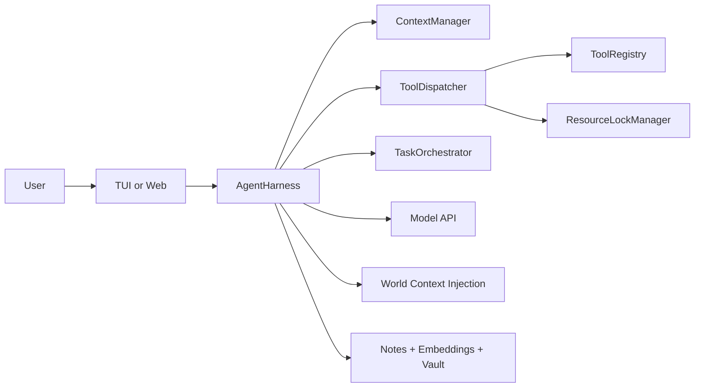

# Liminal

Liminal is a local-first agent runtime for real software execution. It is built for long, tool-heavy tasks where reliability matters more than demo fluency.

The system combines:

- strict tool execution contracts
- lock-safe concurrency and child-agent orchestration
- context compression + working-state management
- durable memory and Obsidian-compatible vault integration
- real-time TUI/web interfaces
- eval packs that detect behavioral regressions

## Why It Exists

Most agent stacks are "model + tools + prompt". Liminal is focused on runtime guarantees:

- validated arguments and guarded tool calls
- bounded retries and anti-loop controls
- deterministic resource locking across concurrent tasks
- explicit long-horizon state (`mission`, `contracts`, `drift`, `recovery`)
- evidence-aware finalization and critic checks

## Fast Start

### 5-minute setup

1. **Prerequisites**

- Node.js 22+
- npm 10+
- Any OpenAI-compatible provider key (OpenRouter/OpenAI/xAI/Anthropic-compatible gateway)

1. **Install**

```bash
npm install
```

1. **Create `.env`**

```bash
AGENT_API_KEY=your_key_here
AGENT_API_BASE_URL=https://openrouter.ai/api/v1
AGENT_MODEL=openrouter/owl-alpha
PORT=3001
```

1. **Build once**

```bash
npm run build
```

1. **Run an interface**

```bash
npm run tui
# or
npm run web
```

### Provider swap examples

- **OpenRouter**
  - `AGENT_API_BASE_URL=https://openrouter.ai/api/v1`
  - `AGENT_MODEL=openrouter/owl-alpha`
- **OpenAI-compatible endpoint**
  - `AGENT_API_BASE_URL=<your-compatible-base-url>`
  - `AGENT_MODEL=<provider-model-slug>`
- **Fallback key envs (if `AGENT_API_KEY` is unset)**
  - `OPENROUTER_API_KEY`, `OPENAI_API_KEY`, `ANTHROPIC_API_KEY`, `XAI_API_KEY`

### What success looks like

- TUI header shows model + context percentage.
- Asking "what model/harness are you using?" returns explicit model/base URL and `Liminal AgentHarness`.
- `npm run typecheck` and `npm run test --workspace=@liminal/core` both pass.

## What's New

### Upgrade V — Intelligence & Autonomy

**Spaced-repetition memory ranking** — `recall_relevant` now multiplies every BM25+recency score by an exponential decay factor (30-day half-life, 0.25 floor). Notes not accessed recently rank lower automatically; frequently-used notes resist decay. Configurable via `halfLifeDays` on `RankableDoc`.

**Semantic context compression** — When the context window fills, old rounds can now be compressed into a causal narrative instead of raw tool-name one-liners. Enable with `AGENT_COMPRESS_SEMANTIC=1`. The harness passes a `semanticSummarizer` callback to `ContextManager` which calls the model to generate a coherent reasoning digest, preserving causal chain across very long sessions.

**Automatic reflexion pipeline** — On all-tool-failure rounds the harness now extracts a structured lesson `{lesson, root_cause, fix_pattern}` via the model and stores it as a `reflection:` typed memory note. Future sessions surface this note via `recall_relevant`. Also bumps `rule_stats` error-prevented counters for any R-* rule IDs found in the error context.

**Rule effectiveness tracking** — Named R-* protocol rules accumulate hit counts and errors-prevented stats in `.agent_rule_stats.json`. Use `formatRuleStatsReport()` to surface a leaderboard. Rule IDs are extracted automatically from error summaries and rule text via `extractRuleIds()`.

**Task DAG scheduling** — `spawn_agent` now accepts a `depends_on` string array. The orchestrator's `waitForDependencies()` polls until all upstream tasks reach terminal state before the dependent task is unblocked. `dependenciesMet()` provides a synchronous snapshot check. `TaskRecord` carries `dependsOn` for introspection.

**Cross-harness shared memory bus** — `SharedMemoryBus` is created once on the root harness and automatically propagated to every child via `forkChild`. Sub-agents can `publish(key, value, publisherId)` facts and `read` each other's output without going through the parent's conversation history. Subscribers receive notifications on every write.

**Goal decomposer tool** — `decompose_goal(goal, context?, max_nodes?)` calls the configured model to break a high-level goal into a typed task DAG. Nodes are `sequential` or `parallel` and each carries an `agent_role` hint ready to paste into `spawn_agent`'s `system_prompt`. Returns full JSON DAG plus a human-readable summary.

**Multi-path exploration tool** — `branch_explore(question, approach_a, approach_b, context?)` spawns two read-only critic sub-agents with divergent exploration angles, waits for both in parallel, then uses the model as a judge to pick the winner (`A`, `B`, or `both`) and synthesise a conclusion. Falls back gracefully if the judge call fails.

**Execution contract verifier** — `verify_contract(mark_done?, goal_summary?)` reads `ExecutionState` from the harness and renders a structured report: mission status, per-milestone progress (✓/▶/✗/○), time-budget consumption with overage warnings, success criteria, drift score with severity label, high-severity commitments, and recent recovery events. Can atomically mark the active contract as `verified`.

**Adaptive system prompt** — `buildProtocolDynamicSuffix` now accepts an optional `intentHint` and reads `AGENT_PROTOCOL_INTENT_HINT` from the environment. Heavy irrelevant sections are suppressed per intent class, saving 300–800 tokens on focused turns without dropping any guardrails:
- `coding` → skips vault KB, markets, document engine
- `execution` → skips markets, document engine
- `introspection` → minimal set only (skips vault, markets, doc, vision)
- `knowledge` / unset → full output (default, no change)

**Plugin/extension system** — Set `AGENT_PLUGIN_DIR` to a directory of `.js`/`.mjs` files. Each must export `register(registry, emitter)`. Call `loadPlugins(registry, emitter)` at startup; it returns a per-file `{file, ok, error?}` report and emits errors for failed plugins. Plugins participate in the full tool system including lazy loading and tool families.

---

## Core Runtime Guarantees (Most Important)

1. **World-grounded operation**
  Root sessions inject world context (current date/time/timezone, OS, shell, cwd, git, project signals, memory summary, repo map). This prevents time/shell hallucination drift.
2. **Strict tool dispatch pipeline**
  Every tool call goes through schema validation, argument guardrails, optional safety policy, lock acquisition, approval flow, then execution.
3. **Long-horizon coherence state**
  Runtime tracks mission/contracts/milestones, heartbeat and drift score, contract transitions, and recovery actions when rounds fail. Use `verify_contract` to inspect the active contract mid-task.
4. **Research quality controls**
  Query diversity checks, duplicate-intent throttling, temporal anchoring for latest/news searches, and synthesis checklist nudges.
5. **Memory + vault knowledge growth**
  Retrieval prefers memory/vault before web. `recall_relevant` applies spaced-repetition decay so stale notes naturally rank lower. Research-style runs can auto-persist durable notes.
6. **UI streaming hardening**
  Stream chunk normalization and buffered flush ordering reduce garbled glyphs and repaint artifacts in TUI/web.

## Architecture Snapshot




Package layout:

```text
packages/
  core/   Harness engine, dispatcher, context, orchestration
  tools/  Tool implementations, protocol, tool catalog
  tui/    Ink terminal interface
  web/    Express + SSE + React client
  eval/   Scenario runner and assertion packs
```

Build order matters: `core` -> `tools` -> (`tui` / `web` / `eval`)

## Commands

Root:

```bash
npm run build
npm run tui
npm run web
npm run typecheck
npm run test
```

Workspace-specific:

```bash
npm run build -w packages/core
npm run build -w packages/tools
npx tsc --noEmit -p packages/core/tsconfig.json
npx tsc --noEmit -p packages/tools/tsconfig.json
npx tsc --noEmit -p packages/tui/tsconfig.json
npx tsc --noEmit -p packages/web/tsconfig.json
npm run eval -w packages/eval
```

## Essential Configuration Profiles

Use `.env.example` for full options.

- **Minimal stable**
  - `AGENT_API_KEY`
  - `AGENT_API_BASE_URL`
  - `AGENT_MODEL`
  - `PORT=3001`
- **Safety-first**
  - `AGENT_SAFETY_JUDGE=1`
  - `AGENT_DESTRUCTIVE_GATE=balanced`
  - `AGENT_APPROVAL_TIMEOUT_MS=120000`
- **Memory-rich**
  - `AGENT_EMBED_MODEL=openai/text-embedding-3-small`
  - `AGENT_MEMORY_AUTO_EXTRACT=1`
  - `AGENT_RECALL_EVERY_N=3`
  - `AGENT_MEMORY_GRAPH=1`
- **Vault wiki mode**
  - `AGENT_VAULT_PATH=C:\path\to\vault`
  - `AGENT_VAULT_AUTO_WRITE=research` (default behavior when unset)
  - `AGENT_VAULT_FIRST_STRICT=1` (optional strict blocking mode)
- **Long-session / deep reasoning**
  - `AGENT_COMPRESS_SEMANTIC=1` — causal narrative compression instead of one-liners
  - `AGENT_REFLEXION_SEMANTIC=1` — structured lesson extraction on failure (root cause + fix pattern)
  - `AGENT_PROTOCOL_INTENT_HINT=coding` — trim 300–800 tokens of irrelevant protocol sections
- **Plugin extensions**
  - `AGENT_PLUGIN_DIR=/path/to/plugins` — load custom `.js`/`.mjs` tool plugins at startup

## Documentation Index

Deep technical docs live under `docs/`:

- `[docs/architecture.md](docs/architecture.md)` — engine architecture, lifecycle, invariants
- `[docs/runtime-behavior.md](docs/runtime-behavior.md)` — world context, execution state, drift/recovery, finalization
- `[docs/research-quality.md](docs/research-quality.md)` — query diversity, anti-looping, time anchoring, synthesis quality
- `[docs/memory-and-vault.md](docs/memory-and-vault.md)` — memory model, vault policy, auto-write semantics
- `[docs/ui-streaming.md](docs/ui-streaming.md)` — TUI/web streaming model and artifact mitigation
- `[docs/configuration.md](docs/configuration.md)` — grouped `AGENT_`* flags with defaults and interactions
- `[docs/telemetry-and-events.md](docs/telemetry-and-events.md)` — event catalog and observability semantics
- `[docs/evaluation.md](docs/evaluation.md)` — eval scenarios, guarantees, and extension patterns
- `[docs/troubleshooting.md](docs/troubleshooting.md)` — common failures and runbooks

## Common Tasks

- **Switch model/provider now (persisted):**
  - "From now on use `<model-slug>` and persist this."
- **Enable safer behavior:**
  - set `AGENT_SAFETY_JUDGE=1`, `AGENT_DESTRUCTIVE_GATE=balanced`
- **Research-heavy mode:**
  - set `AGENT_QUERY_REWRITE=1`, `AGENT_RECALL_EVERY_N=3`, `AGENT_VAULT_AUTO_WRITE=research`
- **Diagnose streaming/retry issues:**
  - see `[docs/ui-streaming.md](docs/ui-streaming.md)` and `[docs/troubleshooting.md](docs/troubleshooting.md)`

## Contributing

- Preserve `core`/`tools` boundaries (avoid circular coupling).
- Be careful with harness-scoped tools in child-agent creation paths.
- Validate with typecheck/tests and a UI smoke run for behavioral changes.
- Include rationale for safety, memory, orchestration, or protocol shifts.

For additional implementation constraints, see `CLAUDE.md`.