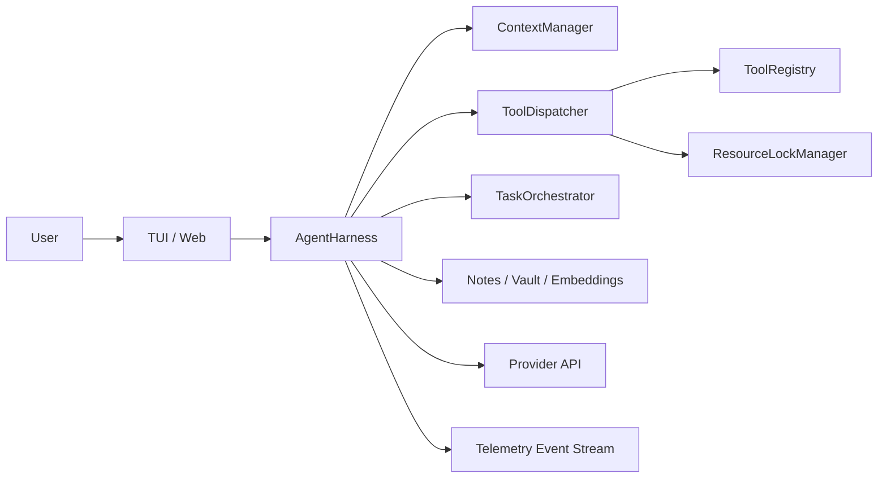
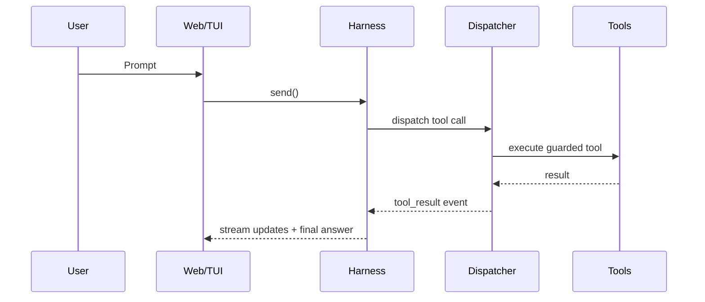

# Liminal

Liminal is a local-first, production-oriented agent runtime for tool-heavy software work.  
It is designed for reliability over demo polish: strict tool execution, resilient orchestration, and long-horizon task continuity.

## Table of Contents

- [What Liminal Is](#what-liminal-is)
- [Why It Exists](#why-it-exists)
- [Capability Overview](#capability-overview)
- [Architecture](#architecture)
- [Execution Model](#execution-model)
- [Safety and Guardrails](#safety-and-guardrails)
- [Memory and Knowledge](#memory-and-knowledge)
- [Interfaces and Observability](#interfaces-and-observability)
- [Compatibility Matrix](#compatibility-matrix)
- [What Liminal Is Not](#what-liminal-is-not)
- [Repository Layout](#repository-layout)
- [Quick Start](#quick-start)
- [Quick Capability Demo](#quick-capability-demo)
- [Commands](#commands)
- [Configuration Profiles](#configuration-profiles)
- [Evaluation Strategy](#evaluation-strategy)
- [Common Operator Workflows](#common-operator-workflows)
- [Production Posture](#production-posture)
- [Security and Data Handling](#security-and-data-handling)
- [Known Limits](#known-limits)
- [Troubleshooting Quick Hits](#troubleshooting-quick-hits)
- [Documentation](#documentation)
- [Roadmap and Release Discipline](#roadmap-and-release-discipline)
- [License](#license)
- [Contributing](#contributing)

## What Liminal Is

Liminal is a full runtime for autonomous and semi-autonomous AI agents, not just a prompt wrapper.  
It combines:

- a structured ReAct harness
- strict tool dispatch and argument validation
- task orchestration and resource locking
- context management under token pressure
- durable memory and vault integration
- streaming UIs (TUI and web)
- evaluation packs for regression detection

In short: Liminal focuses on operational reliability, explicit state, and debuggability for real work.

## Why It Exists

Most agent stacks are modeled as model plus tools plus prompt. That is often sufficient for demos, but brittle for long-running, high-stakes, or multi-step execution. Liminal adds runtime guarantees:

- deterministic dispatch path for every tool call
- explicit boundaries for destructive actions
- anti-loop and retry controls
- lock-safe shared resource access
- long-horizon execution state (mission, contracts, drift, recovery)
- observable event streams for auditability
- eval suites to catch behavioral regressions before they ship

## Capability Overview

### Runtime Engine

- ReAct loop with bounded tool rounds
- retry logic for transient upstream failures
- context budget awareness and compression
- structured turn termination with telemetry

### Tooling and Orchestration

- strongly typed tool registry
- deep argument validation before handler execution
- per-tool resource locks (file/shell/etc.) to prevent race conditions
- child-agent orchestration for parallelizable workloads
- task registry with lifecycle state and completion/failure tracking

### State and Long-Horizon Coherence

- epistemic state for current subgoals and working memory
- execution state for contracts, milestones, and drift scoring
- explicit recovery strategy tracking after failures
- evented runtime heartbeat and transition reporting

### Memory and Retrieval

- typed durable memory notes
- hybrid retrieval modes (exact/lexical/hybrid)
- memory consolidation workflows
- optional graph-style memory linking
- Obsidian-compatible vault tooling for knowledge base workflows

### Interfaces

- TUI (Ink) for terminal-native execution
- web interface with SSE streaming for live updates
- approval and ask-user loops integrated into both interfaces
- structured tool call cards and progress reporting

### Evaluation

- scenario-based eval packs
- reliability/noise/context tests
- memory retrieval precision tests
- long-horizon and orchestration capability checks

## Architecture



### Architectural Principles

- **Separation of concerns**: `core` contains runtime logic, `tools` contains implementations
- **Predictable side effects**: destructive operations are gated and observable
- **Concurrency correctness**: lock order and task orchestration are first-class
- **Recoverability**: failures produce structured signals for diagnostics and adaptation
- **Evolvability**: tool families and modular services support incremental extension

## Execution Model

At a high level, a user turn follows this path:

1. context and intent are prepared
2. model emits text and/or tool calls
3. each tool call passes through dispatch safeguards
4. results are appended into context
5. loop continues until finalization criteria are met
6. turn-end telemetry and post-turn routines run

This lets Liminal support both short interactive tasks and long-running compound tasks with consistent behavior.

## Safety and Guardrails

Liminal includes multiple guardrail layers:

- schema-level argument checks
- safety judge and approval gates for risky actions
- destructive tool preflight constraints
- retry ceilings and anti-loop behavior
- resource lock management to avoid conflicting writes
- explicit user approval/answer channels for uncertain operations

The goal is not “no risk,” but controlled and inspectable execution with clear operator override points.

## Memory and Knowledge

Liminal distinguishes between:

- **working state** (in-turn task context)
- **durable memory** (typed notes across turns/sessions)
- **vault knowledge** (linked long-form notes/workspace wiki)

Retrieval strategies prioritize internal memory and vault context before expensive external fetches, and memory systems are designed for consolidation instead of unbounded accumulation.

## Interfaces and Observability

Liminal is built to be operable, not opaque.

- streaming event model across TUI/web
- task and subtask lifecycle visibility
- approval and question flows surfaced in UI
- tool activity and timing visibility
- runtime telemetry events for diagnostics and eval instrumentation

This provides a practical operator loop: inspect, intervene, resume.



## Compatibility Matrix

| Area | Supported / Expected | Notes |
|---|---|---|
| Operating systems | Windows, macOS, Linux | Windows PowerShell behavior is explicitly supported in runtime guidance. |
| Node.js | 22+ | Older Node versions are not validated in this repo. |
| npm | 10+ | Workspace commands assume modern npm workspaces support. |
| Model provider API | OpenAI-compatible chat/completions APIs | OpenRouter default; other compatible gateways can be used via env. |
| Interfaces | TUI and Web | TUI uses Ink; Web uses Express + SSE + React. |
| Persistent memory | Local files in workspace | Optional vault integration requires user-provided vault path. |
| GPU / special hardware | Not required | Standard local development machine is sufficient. |

## What Liminal Is Not

- not a hosted SaaS control plane
- not a no-code automation builder
- not a generic chat wrapper with light tool calling
- not a fully autonomous “hands-off forever” system without operator oversight
- not a replacement for your domain-specific backend/business logic

Liminal is a runtime foundation for serious agent execution: reliable tooling, explicit state, and observable control loops.

## Repository Layout

```text
packages/
  core/   Runtime engine, orchestration, context, safety, memory ranking
  tools/  Tool implementations, protocol, and tool families
  tui/    Ink terminal interface
  web/    Express + SSE server and React client
  eval/   Scenario-based evaluation suite
```

Build order matters: `core` -> `tools` -> (`tui` / `web` / `eval`)

## Quick Start

### Prerequisites

- Node.js 22+
- npm 10+
- OpenAI-compatible model endpoint (OpenRouter/OpenAI/other compatible gateway)

### 1) Install

```bash
npm install
```

### 2) Configure environment

Create `.env` in repo root:

```bash
AGENT_API_KEY=your_key_here
AGENT_API_BASE_URL=https://openrouter.ai/api/v1
AGENT_MODEL=openrouter/owl-alpha
PORT=3001
```

### 3) Build

```bash
npm run build
```

### 4) Run

```bash
# terminal UI
npm run tui

# web UI
npm run web
```

## Quick Capability Demo

After startup, try these prompts to validate core behavior quickly:

1. **Tooling and execution**
   - Ask: “List the repository packages and summarize each one briefly.”
   - Expect: real file/tool usage with concrete paths, not guessed answers.

2. **Memory-aware operation**
   - Ask a short preference statement, then later ask it back.
   - Expect: retrieval from memory systems where configured, not random recall.

3. **Guarded operations**
   - Ask for a risky action (e.g., destructive shell intent).
   - Expect: policy/approval boundaries instead of blind execution.

4. **Observability**
   - Use web UI and confirm streaming progress, tool activity, and turn completion states.

Success criterion: answers are evidence-backed and operationally traceable, not merely fluent.

## Commands

### Root Commands

```bash
# full build + checks
npm run build
npm run typecheck
npm run test

# interfaces
npm run tui
npm run web
npm run web:dev
```

### Workspace-specific

```bash
npm run build -w packages/core
npm run build -w packages/tools
npx tsc --noEmit -p packages/core/tsconfig.json
npx tsc --noEmit -p packages/tools/tsconfig.json
npx tsc --noEmit -p packages/tui/tsconfig.json
npx tsc --noEmit -p packages/web/tsconfig.json
npm run eval -w packages/eval
```

## Configuration Profiles

Use `.env.example` for the full set of options.

- **Minimal**
  - `AGENT_API_KEY`
  - `AGENT_API_BASE_URL`
  - `AGENT_MODEL`
- **Safety-first**
  - `AGENT_SAFETY_JUDGE=1`
  - `AGENT_DESTRUCTIVE_GATE=balanced`
- **Memory-heavy**
  - `AGENT_EMBED_MODEL=<embedding-model>`
  - `AGENT_MEMORY_AUTO_EXTRACT=1`
  - `AGENT_RECALL_EVERY_N=3`
- **Vault mode**
  - `AGENT_VAULT_PATH=<absolute-path>`
  - `AGENT_VAULT_AUTO_WRITE=research`

### Minimal Example

```bash
AGENT_API_KEY=your_key_here
AGENT_API_BASE_URL=https://openrouter.ai/api/v1
AGENT_MODEL=openrouter/owl-alpha
PORT=3001
```

### Practical Notes

- If `AGENT_API_KEY` is unset, provider-specific fallback key envs may be used depending on runtime config.
- For long sessions, enable memory/retrieval options incrementally and validate with evals.
- For safety-sensitive workflows, enable approval and safety-judge features before enabling high-autonomy modes.

## Evaluation Strategy

`packages/eval` contains scenario packs for:

- reliability and error recovery
- memory retrieval quality
- context compression robustness
- multi-hop reasoning
- orchestration and long-horizon autonomy
- research and synthesis quality

Run targeted evals before and after major runtime changes to ensure behavior improves without regressions.

## Common Operator Workflows

### Safe rollout for new runtime features

1. implement behind a clear gate/config
2. typecheck and unit test affected packages
3. run focused eval scenario(s)
4. run interactive smoke checks in TUI/web
5. roll out with telemetry monitoring enabled

### Improving response quality without destabilizing execution

- prefer prompt/protocol and retrieval adjustments first
- use memory/vault and query quality tuning for research tasks
- only then adjust orchestration autonomy or retry behavior
- validate each change with eval and a reproducible manual scenario

### Diagnosing runtime issues quickly

- inspect recent tool/error events and task states
- check context pressure/compression behavior
- verify lock ownership for conflicting resources
- reproduce with minimal input and capture telemetry
- patch, retest, and compare behavior against baseline eval

## Production Posture

Liminal is production-oriented but should be adopted with explicit rollout controls.

- **Recommended rollout path**
  1. start in local dev with strict safety gates
  2. validate on representative tasks
  3. gate high-autonomy behaviors behind explicit config flags
  4. monitor telemetry and regressions continuously

- **Operational stance**
  - Prefer deterministic workflows over maximum autonomy for critical paths.
  - Keep risky/destructive actions approval-gated unless there is a strong reason to relax.
  - Treat eval regressions as deployment blockers for runtime-behavior changes.

- **Support level**
  - Core runtime architecture is stable and actively developed.
  - Some advanced autonomy features are tunable/experimental and should be validated per environment.

## Security and Data Handling

### Data locality

- Runtime state, memory notes, and artifacts are stored locally in workspace-scoped files.
- Optional vault integration writes to user-controlled vault path.

### Provider-boundary behavior

- Prompts, relevant context, and tool-derived content may be sent to configured model provider endpoints.
- You control destination via `AGENT_API_BASE_URL` and model/provider env configuration.

### Sensitive data guidance

- Do not commit secrets in `.env` or generated artifacts.
- Use least-privilege credentials for provider keys and external APIs.
- Treat logs/artifacts as potentially sensitive operational records.

### Approval and safety controls

- Enable `AGENT_SAFETY_JUDGE=1` for stricter automatic risk classification.
- Keep destructive actions gated (`AGENT_DESTRUCTIVE_GATE` and approvals) in high-risk environments.

## Known Limits

- Liminal depends on quality and reliability of the configured upstream model provider.
- Long-horizon autonomous behavior requires careful tuning and environment-specific validation.
- No single default profile is optimal for all workloads; configuration should be intentional.
- Root README is an operator/contributor overview; deep internals live in `docs/` and `CLAUDE.md`.

## Roadmap and Release Discipline

This repository emphasizes behavior quality over raw feature count.

- Major runtime behavior changes should include:
  - rationale
  - test/eval coverage
  - operational notes (flags, migration, risk profile)

- Recommended practice:
  - ship behind flags where possible
  - measure before/after with eval packs
  - document rollout and fallback paths

## License

No top-level `LICENSE` file is currently present in this repository.  
If you intend external distribution or third-party contribution at scale, add an explicit license file.

## Documentation

See `docs/` for implementation details:

- `docs/architecture.md`
- `docs/runtime-behavior.md`
- `docs/memory-and-vault.md`
- `docs/research-quality.md`
- `docs/telemetry-and-events.md`
- `docs/evaluation.md`
- `docs/troubleshooting.md`

Larger implementation constraints and operational conventions live in `CLAUDE.md`.

## Troubleshooting Quick Hits

- **Build/type issues after core changes**: rebuild `packages/core` before dependent workspace checks.
- **Web not updating**: ensure correct server process is restarted after env/runtime changes.
- **Memory behavior surprising**: verify enabled memory flags and retrieval profile.
- **Autonomy too aggressive**: lower autonomy gates and re-enable explicit approvals.
- **Stale lock/race symptoms**: inspect task/lock ownership and process lifecycle before retrying.

## Contributing

- preserve `core`/`tools` boundaries and avoid circular dependencies
- keep harness-scoped tool behavior explicit and testable
- run typecheck/tests before opening a PR
- document rationale for safety, orchestration, or memory behavior changes

For repository-specific implementation rules, see `CLAUDE.md`.